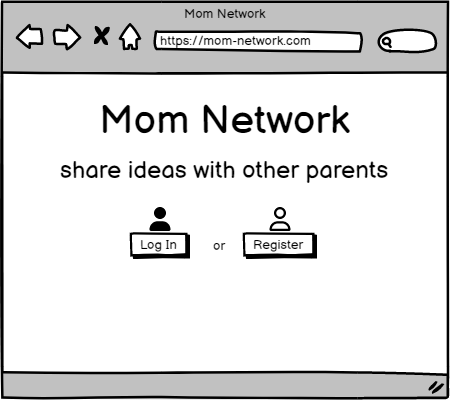
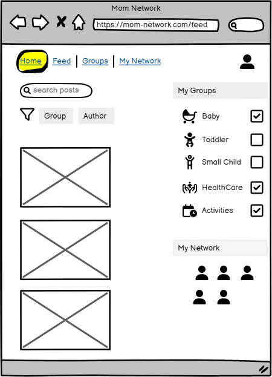
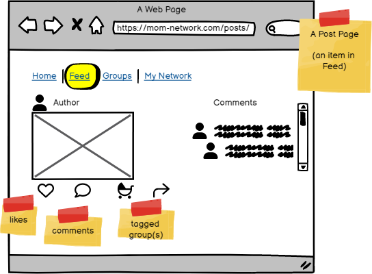
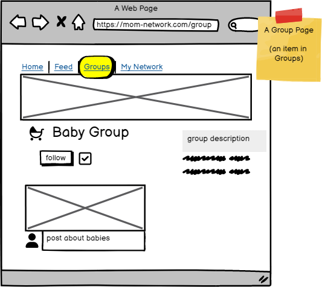
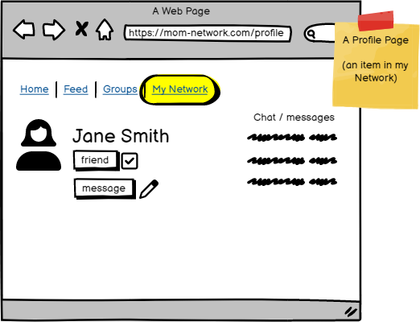

#LIVE LINK: https://mom-network.herokuapp.com/

# Mom-Network
Portfolio Project nr. 5 for Code Institute Assessment. Mom Network - Communication Tool for Busy Mothers.

### Project purpose:

In this project, you will design and build a content-sharing web application with React and an API (Django Rest Framework) Back-End. This will allow your users to browse and comment/ like each other's content as well as add, edit and delete their own. The users will also be able to follow one another.

The data is presented in a way that makes it easy for users to find what they're looking for.

### Main Technologies

- HTML, CSS, JavaScript
- React.js
- Bootstrap.js
- Django REST Framework

### Project Idea: Content Platform

Create a community-based publishing platform to share ideas, stories, tutorials and journalistic articles. Now that you're a fully-fledged web developer you've decided it's probably time for you to start your very own cool, modern content platform, offering a publishing portal to a global audience. To provide the best user experience, the platform will be available via a browser-based interface.

Suggested functionality:

The platform should enable users to create, read, comment and vote on content.
Content should be searchable and categorized.
Search results can be filtered on username, popularity, date created, title, content keywords and category.

### Wireframes

### Initial Terminal commands

npx create-react-app . --use-npm

npm start