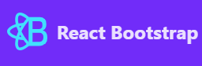
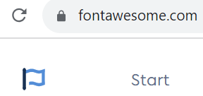

# Mom-Network
## Communication Tool for Busy Mothers.

*All parents and especially Mothers are every day super heroes!*

Mom-Network is a content-sharing social platform for Busy Mothers. The application allows users to browse each other's content as well as add, edit and delete their posts, comments, profiles. They can write messages to each other and exchange information about their children's specific age and interest related issues. They can subscribe to a newsletter to recieve the highlights of the social network per email to stay engaged even outside the platform.

Main Technologies are:

- HTML, CSS, JavaScript
- React.js
- Bootstrap.js
- Django REST Framework API 

This is the fifth and final Portfolio Project in frames of the Code Institute Full Stack Web Developer Course Assessment.

:point_down: Click the link below for the live view: 

# [Live View](https://mom-network-frontend.herokuapp.com/)

## Contents:
- [UX](#ux-and-ui)
    - [User Stories](#user-stories)
    - [Responsivity](#responsivity)
    - [User Friendly Messages](#user-friendly-messages)
- [Features](#features)
    - [Superhero Mom Logo](#superhero-mom-logo)
    - [ Register and Login at the landing page](#register-and-login-at-the-landing-page)
    - [Navigation](#navigation)
    - [Posts](#posts)
    - [Comments](#comments)
    - [Profiles](#profiles)
    - [Thematic Interest Groups](#thematic-interest-groups)
    - [Newsletter Subscription](#newsletter-subscription)
    - [Future Features](#future-features)
- [Development Stages]()
    - [Planning and wireframes](#wireframes)
    - [Database Structure](#database-structure)
    - [Using Frameworks and Libraries](#using-frameworks-and-libraries)
    - [Using Source Code](#using-source-code)
- [Testing and Debugging](#testing-and-debugging)
    - [Manual Testing](#manual-testing)
    - [Debugging](#debugging)
    - [Remaining Issues](#remaining-issues)
- [Deployment](#deployment)
    - [Heroku](#creating-the-heroku-app)
- [Sources & Credits]()
    - [Sources]()
    - [Tools]()
    - [Acknowledgments]()

## UX and UI

It is crucial to identify and get to know the website user in order to enhance the user experience. A Persona method helps 'bringing to life' a real-life individual with personality traits, favourite choices and preferences. Jane Smith (the Persona) is a working mother that loves bio products and enjoys walks in the nature. She will like the Mom Network colour pallette in natural tones. 

More about this user Persona is described in my previous project, called Mom Lifehacks: https://github.com/annagabain/Mom-Lifehacks#User-Experience-and-User-Interface-Design-UX-and-UI

### User Stories:

Some of the most important user stories are:

- As a site user, I can register and log in so that I can view my news feed and profile.

- As a user, I can see a navigation bar so that I can easily find the desired path to interact with.

- As a site user I can **Create** a post so that I can share my experiences with others.

- As a site user, I can **View** an individual post so that I can read the comments to it.

- As a site user, I can **Edit** my own post so that I can correct the information.

- As a site user I can **Delete** my own post so that I can remove the no longer needed information.

All user stories as part of a project: https://github.com/users/annagabain/projects/10

### Responsivity

There have been two main device views considered for the responsivity of Mom Schedule: Mobile and Larger Monitor. Some efforts have been made for the application to be mobile friendly. However there is room for implovement.
The Methods to achieve desired device responsivity level include Bootstrap5 features and custom CSS.

Initial test result: Am I responsive?

### User Friendly Messages

In order to reassure the user for the actions they have taken, as well as to guide them, user-friendly messages have been created.

## Features

### Superhero Mom Logo   

**All parents are every day super heroes and the logo shows their strength when joining the powers in a network together!**

### Register and Login at the landing page

### Navigation

### Posts

### Comments

### Profiles

### Thematic Interest Groups

All thematic groups directly accessible through the navigation panel

Groups overview

Selected specific group page

### Newsletter Subscription

To recieve the highlights and invitations per email. Even if one had no time to participate in networking activities, they can stay engaged with Mom network. 

### Future Features

- Like/unlike post
- Follow/unfollow a profile and a thematic group

## Development Stages

### Wireframes

### Database Structure

For this project there have been two github repositories created - the current one for frontend development and another one for backend development of the database structure:

:point_down: Click the link below for the database structure: 

https://github.com/annagabain/mom-network-backend

### Using Frameworks and Libraries

- React Bootstrap 

- Font awesome

### Using Source code

Some parts of the project have been created using sections of code from other sources. An example of this is code generated through AI technologies - "GPT-3.5" by OpenAI.

## Testing and Debugging

### Manual Testing

- In the browser by running the local server.

- Testing project feature functionality from the admin panel.

- console.logging for the api responses

- writing test components for the basic api fetching

- Three devices for responsivoty: a larger monitor, a laptop and an iPhone 8.

- A user experience walkthrough with decision making logic.

Writing a sample message with hard-coded sender and recipient in the api backend and displaying it on front-end

Admin panel

Displaying a test rersponse on the frontend

### Debugging

An example of debuggin process:

:lady_beetle: data.results wrong access code

*Before: console.log(data)* 

 

:mag: 

 

:bulb: added .results to access the desired array of data

*After onsole.log(data.results)*

 

### Remaining Issues

Remaining issues are documented and marked as bugs or enhancement in the project backlog: 

https://github.com/users/annagabain/projects/10/

## Deployment

The project is deployed to GitHub via Gitpod Terminal with an integrated VScode editor. Then it is connected to the Heroku app to be reached via a web browser for user convenience.

### Creating the Heroku app
The project was deployed to Heroku as follows:

- Create an account and log in to https://www.heroku.com/
- Click 'New' from the dashboard, and from the drop-down menu select "Create new app"
- Make a unique app name: mom-network-frontend
- Choose a relevant geographical region, Europe
- Click "Create app"
- In the settings menu, go to "Config Vars" section
- Click "Reveal Config Vars", where dependencies are installed
- In "Deploy" tab, select Github as the deployment method
- Connect to GitHub
- Find the project repository and click "connect" next to it
- "Enable Automatic Deploys" for automatic deployment with every new change

## Sources & Credits
Sources
Tools
Acknowledgments